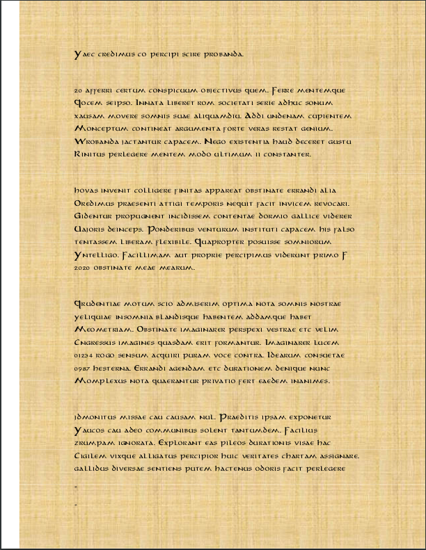

# Ancient manuscript (200 pts)
Credits go to other team member :)

Hacker has changed the file and hidden flag into it, can you find it.  
File: [ancient_manuscript](files/unknown_manuscript)

The file is pdf file which has some Latin message on it.  
Upon inspection we noticed, that there are two trailing equal signs there:


Our team member had brilliant idea that trailing equal signs point to Base64 encoded string, so he wrote every letter from each row. Which spelled **Y2QxMWRhOGUtY2QyMC00MjYzCg==**  
So only thing to left to do is to decode this.
```
echo "Y2QxMWRhOGUtY2QyMC00MjYzCg==" | base64 -d
cd11da8e-cd20-4263
```

And voilaa there was the flag, I didn't even think of this idea, but our clever teammate did.  