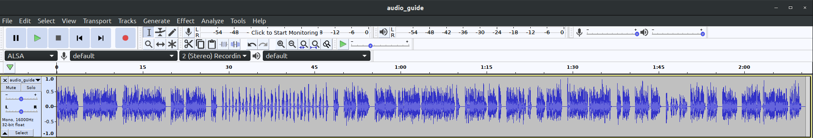

# Audio guide (200 pts)

Find the hidden message from audio recording:  
So we have zip file called: [audio_guide.zip](./files/audio_guide.zip)

Upon opening that file we see that there are four files called:
* xaa
* xab
* xac
* xad

First thing to do with such files is to check what are their actually containing.  
We can do this by running linux command file  
```
file x*
xaa: RIFF (little-endian) data, WAVE audio, Microsoft PCM, 16 bit, mono 16000 Hz
xab: data
xac: data
xad: data
```

From that we can see that there is one file which is audio and other files are just data.  
Looking from names and file sizes I think that it is one file just sliced up to smaller pieces.  
So we can recreate the original audio file by:
```
cat xaa > audio_guide.wav && cat xab >> audio_guide.wav && cat xac >> audio_guide.wav && cat xad >> audio_guide.wav
```
This results in a new audio file which we can listen to, I used audacity to listen to the audio file.


Hidden message starts 27th second and ends at 50th, to write it down better, I slowed down the message and wrote down:  
```
4f24b9b33d14b03f7025d096dfd25
```

I thought I had found the flag, but upon submitting it said that flag is invalid.  
So I had quick idea that maybe the flag is reversed, so to get quick reverse of string I fired up python and did following:
```
Python 3.6.9 (default, Oct  8 2020, 12:12:24) 
[GCC 8.4.0] on linux
Type "help", "copyright", "credits" or "license" for more information.
>>> "4f24b9b33d14b03f7025d096dfd25"[::-1]
'52dfd690d5207f30b41d33b9b42f4'
```
And as my gut feeling was right, it indeed needed to be reversed.