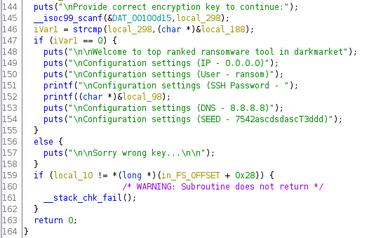
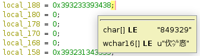

# Ransomware panic (100 pts)

Hacker has installed ransomware on hospidal servers.  
File: [ransomware](files/ransomware)

Our teammate had clever solution to this, although it requires you to run program, in some cases it is safer to disassemble it first and see what it does ;)

So lets fire up ghidra and see what this file does, afterwards I'll show our teammate solution aswell

  
From this image we see that, strcmp is used to compare two strings, one which is read from user and second one which is stored in variable called **local_188**, there are alot of other variables declared as well to make it more messier.

So lets look up the local_188 variable:  


We can see that it has char value of **849329**

So from main we see that this program is safe to run since it just prints and asks for some code:
```
$ ./ransomware
Welcome to CBXCTF ransomware this tool allows You to encrypt Linux servers & workstations in a minute and ask for high ammount of money to retrieve data

Provide correct encryption key to continue:
849329


Welcome to top ranked ransomware tool in darkmarket

Configuration settings (IP - 0.0.0.0)

Configuration settings (User - ransom)

Configuration settings (SSH Password - l33tSSHkey2020
Configuration settings (DNS - 8.8.8.8)

Configuration settings (SEED - 7542ascdsdascT3ddd)
```

Flag in this case is the SSH Password: **l33tSSHkey2020**

Alternative solution from our teammate was to use ltrace.  
ltrace is a program which allows you to follow different library calls.
```
ltrace ./ransomware 
puts("\nWelcome to CBXCTF ransomware th"...
Welcome to CBXCTF ransomware this tool allows You to encrypt Linux servers & workstations in a minute and ask for high ammount of money to retrieve data
)                                                                                      = 154
puts("\nProvide correct encryption key "...
Provide correct encryption key to continue:
)                                                                                      = 45
__isoc99_scanf(0x556051fd5d15, 0x7ffe6b4f97d0, 0x7f9f8ac9d8c0, 0x7f9f8a9c0264some_random_string
)                                                    = 1
strcmp("some_random_string", "849329")                                                                                            = 59
puts("\n\nSorry wrong key...\n\n"

Sorry wrong key...


)                                                                                                = 23
+++ exited (status 0) +++

```

We can notice from ltrace output that strcmp is called with values **"some_random_string"** and it is compared to **"849329"** which indeed was the key we were looking for, so running program again and entering the key, we get the SSH password this way.