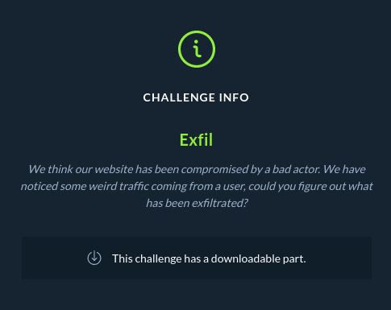
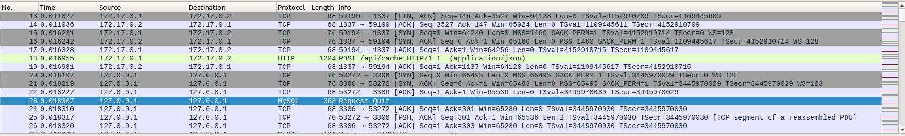
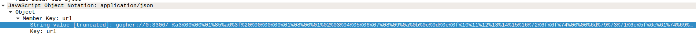
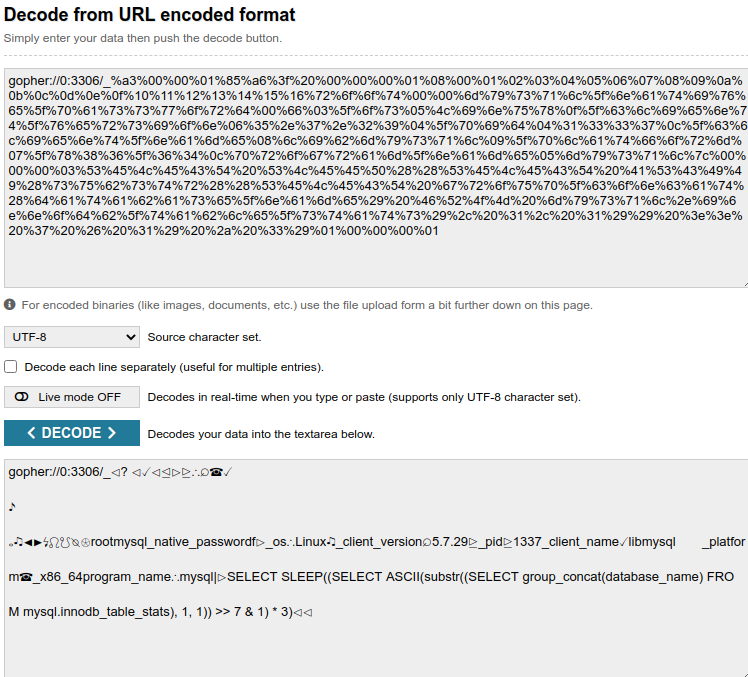
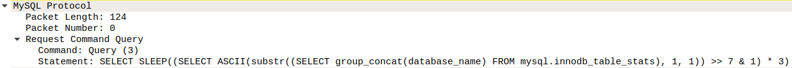
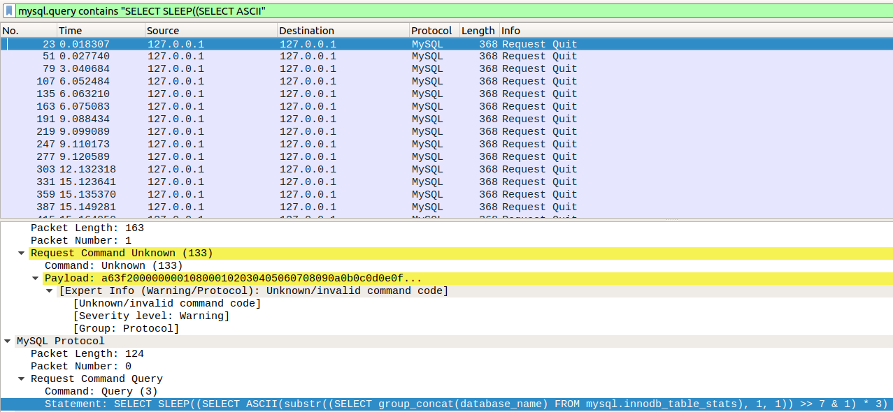

# forensics_exfil (HTBxUni CTF)



Files: [Website traffic capture](files/capture.pcap)  
So we have included capture file from the traffic of the website.

Lets fire up wireshark and have a look what do we have in this capture.

We notice some traffic going on and a post request to /api/cache, lets investigate what this post request has for us.

We notice some bad looking encoded url which uses gopher protocol: [Gopher](https://en.wikipedia.org/wiki/Gopher_%28protocol%29)

This goes to port 3306 which is default port for MySQL database.
Lets decode this ugly looking thing at urldecoder.org


We see that payload has to do with SQL requests, so next place to look in our traffic is for MySQL traffic. Sure enough we find MySQL traffic with the same query which was in encoded request.



So essencially we have dumping values from our database.
Time based solution is used so let's disect this SQL query

1. First of all it is looking for database name inside mysql schema table.
2. Then the query uses mysql function substring, which allows you to extract letters from string. **substr(string, start_from_which_index, how_many_letters_to_get)**, one letter is used.
3. Then ascii value of this letter is requested as an integer.
4. This integer is then shifted 7 times and AND-ed with one essentially this gives us the first bit of the ascii letter.
5. So now the query left is SELECT SLEEP(bit_value * 3), if the bit is 1, MySQL engine sleeps for 3 seconds, if the bit is 0, it returns right away. Quite clever way. Also to get one character this is better than bruteforcing or checking if a, b, c... etc is the first char, since it needs only 8 requests per character.

So now that we have figured out what is being done we need a way to know what was exfiltrated. So for that we first need to find all the MySQL responces.

To do that we can use wireshark filters, we need to look for some good identifier which filters all of the responces. I noticed that every responce we need has MySQL query in them.

So we can use filter: mysql.query contains "SELECT SLEEP((SELECT ASCII"  
This will give us the list of all captured responces which were used to exfiltrate the data.



So lets save this as another pcap file.  
[mysql_dump.pcap](files/mysql_dump.pcap)

Now is time to start writing the code, to extract the values that were exfiltrated, for this I wrote python code:

```python
# PyShark is a tshark wrapper for python, lets you basically use python as wireshark ;)
import pyshark
# Needed for time comparision
import datetime

# Open the capture file and get the captures
# will return list of capture objects, which we can loop over
captures = pyshark.FileCapture('mysql_dump.pcap')

# exfiltrated string 
recovered_chars = ""
# integer value for ascii character
built_character = 0

# remember last capture, since we need to do comparision
last_capture = None

# loop over all captures we have
for capture in captures:

    # remember first one and continue with loop
    # starting condition
    if last_capture == None:
        last_capture = capture

    # do magic here
    else:
        # first lets calculate time difference in seconds between two captures
        sleep_time = (capture.sniff_time - last_capture.sniff_time).total_seconds()

        # Get the sql query of last capture
        mysql_query = str(last_capture.layers[4]._all_fields['mysql.query'])
        # Get the sql query of current capture
        next_mysql_query = str(capture.layers[4]._all_fields['mysql.query'])

        # Split those sql querys into different parts, what we really need is
        # which bit was exfiltrated using this sql query
        # and which letter was extracted
        head, char_index, end = mysql_query.split(",")

        next_head, next_char_index, next_end = next_mysql_query.split(",")

        # Split the query further getting the which bit
        which_bit = end.split(">> ")[1].split(" &")[0]
        # print(which_bit)
        if sleep_time > 2:

            # print(head, char_index, bit)

            # how many times we have to shift, to place the bit at the right place
            built_character |= (1 << int(which_bit))

        # If character we are exfiltrating has changed, we can append it to exfiltrated string
        if char_index != next_char_index:
            # print(next_char_index, char_index)
            # Append it to the end of string
            recovered_chars += chr(built_character)

            # reset the built character ascii value
            built_character = 0

        # remember, current as last and move on
        last_capture = capture

print("Exfiltrated data:", recovered_chars)

# Exfiltrated data: db_m3149screenshots,usersid,user,passwordadminHTB{b1t_sh1ft1ng_3xf1l_1s_c00l
# We can see that the script does a lousy job and misses the last character, I was too
# lazy to fix this since we can already see the flag and know the last character is "}"
```

So there we have the solution!