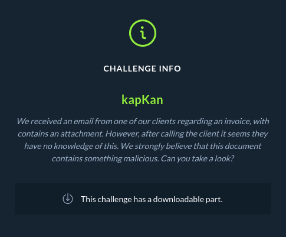
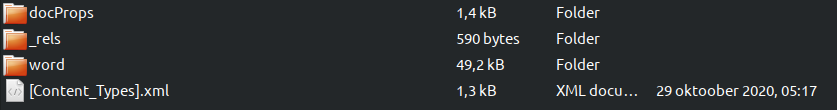
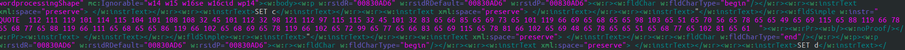

# forensics_kapKan (HTBxUni CTF)



So we have file  
[weird_word_file named invoice.docx](files/invoice.docx)

First since it is word file, we should look for macros or anything like that. But this file doesn't contain macros. It however has some interesting looking stuff written.


So since word files act like archives we can open this with some archiving tool, to do this in linux you can remove .docx extension and it behaves like archive.


What we want to look at what is in the file, so to do this we open directory named word and look for document.xml, this is where contents of the document will be.

Upon looking at it we notice interesting line of numbers looking like that:


This looks hella lot like some ascii character values written in integers.
Lets write a quick script in python to decode it.
```python
# Put all the values into list for looping
numbers = [112,111,119,101,114,115,104,101,108,108,32,45,101,112,32,98,121,112,97,115,115,32,45,101,32,83,65,66,85,65,69,73,65,101,119,66,69,65,68,65,65,98,103,65,51,65,70,56,65,78,65,65,49,65,69,115,65,88,119,66,78,65,68,77,65,88,119,66,111,65,68,65,65,86,119,66,102,65,68,69,65,78,119,66,102,65,72,99,65,77,65,66,83,65,69,115,65,78,81,66,102,65,69,48,65,78,65,65,51,65,68,77,65,102,81,65,61]

# Create string for decoded characters
decoded_string = ""
for character in numbers:
    # Loop over values
    decoded_string += chr(character)

print(decoded_string)

# This is what will be printed:
# powershell -ep bypass -e SABUAEIAewBEADAAbgA3AF8ANAA1AEsAXwBNADMAXwBoADAAVwBfADEANwBfAHcAMABSAEsANQBfAE0ANAA3ADMAfQA=

# We can see that there is a base64 encoded 
import base64

# Slice the given string, get the base64 encoded values
base64_coded_string = decoded_string.split(" ")[4]

# Decode the value into bytes and decode byte values into human readable text using utf-8 encoding
print("Here is your flag!:", base64.b64decode(base64_coded_string).decode('utf-8'))
```