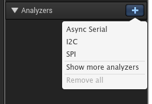
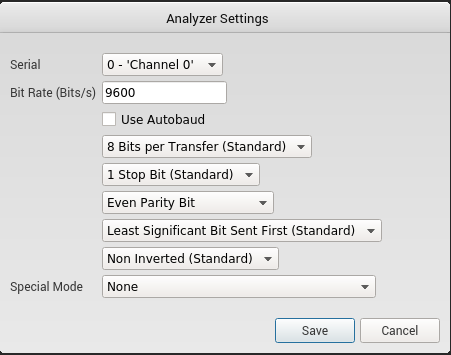

# hw_block (HTB x Uni CTF)


Files provided:   
[flash_dump](files/dump.bin) - flash memory dump  
[sequence.logicdata](files/sequence.logicdata) - intercepted serial communication

So first we need to find out what way flash was read, best bet is that something in sequence.logicdata file tells us about the communication.  
I had previously no clue about .logicdata files, but as CTFs go Google is usually your best friend.

So googling "open .logicdata file" shows as third option website: https://support.saleae.com/faq/technical-faq/can-i-create-or-edit-logicdata-files which looks promising.  
Download link: https://www.saleae.com/downloads/

**PS! Version 1.x is needed for opening logicdata files.**

Upon opening the sequence, we will see some kind of waveform. Since this program is logic analyzer it provides functions of decoding protocols.


As it was said that it was done using weird protocol, lets try to see which protocol it is and what parameters were used, to do that we can select from the right side menu on the Logic program Analyzers "+" opens up dropdown menu.  


Since it is sent on one wire Async serial is a good guess, upon trying different parameters I found out that following parameters were used:  


Program does its job and waveform with decoded values:  


We can extract the values in csv file:  
[decoded_uart.csv](files/decoded_uart.csv) which we can open in any csv tool we like and make it more readable and eatable for further inspection.

So working some formating magic (removing new lines, to get data on one line and replacing "\r\n" symbols with actualy new lines) we get following data:  


From that we can see that it is flash reading protocol, Flash chip used is W25Q128FV, so if we get hardware model number it is always good idea to give a look to datasheet.  
Datasheet: [W25Q128FV](https://www.winbond.com/resource-files/w25q128fv_revhh1_100913_website1.pdf)

From datasheet we can find following information: 
  
Now we know that this flash uses **256 byte pages and 4096 byte sectors**.

Now we have all information we need to know how to extract what was read from the memory.

To solve this we will write short python program which will extract what was read from memory. We can do this since we have memory dump of 16 sectors. And we have serial communication of what was read.

So lets get coding!  
[Code file](files/extractor.py)

```python
# Information from serial communication
# will use later in the code
flash_locations = ["14", "17", "27", "11", "04", "15", "19", "40", "21", "51", "18", "06", "49", "02", "31", "50", "28", "41", "32", "35", "24", "39", "42", "36", "45", "03", "43", "20", "00", "01", "09", "44", "38", "07", "22", "08", "13", "23", "37", "10", "47", "05", "33", "26", "46", "25"]

# We know that we had 16 pages of memory
# 16 * 4096 = 65536 bytes which is our file size.

# Open the file as binary
with open("dump.bin", "rb") as binary_file:
    bytes_from_file = binary_file.read()

# So now is a good idea to explain what we found from sequence.logicdata
# After init it tells how flash is read:
# We have following information "'Comm..xy' 'sector:xCOMMA' 'page:yCOMMA' 'page_offset:xy"
# We can see that it uses x as sector and y as page, also it tells that page_offset is xy
# So x value is for sector, since we have 4096 bytes in sector
# we get address by multiplying x by that value
# y goes for pages so 256 bytes per page, we multiply y by that.
# Finally we have page offset which tells us which byte is read.

# Now we loop over all locations we got and build address formula
# Print out bytes and hopefully enjoy the flag ;)
for location in flash_locations:
    x, y = int(location[0]), int(location[1])

    # This is formula for finding the right bytes to be read
    address = 4096 * x + 256 * y + int(location)
    
    print(chr(bytes_from_file[address]), end='')
print()


# Flag is HTB{M3m0ry_5cR4mbl1N6_c4n7_54v3_y0u_th1S_t1M3}
```

So this was quite fun hardware challenge, I spent way too much time figuring out the logic how flash is managed I knew that it uses sectors and pages, I had heard about page offset aswell, but usually in flash sequencial data is stored sequencially if some weird wear-leveling is not used.  

This challenge just didn't follow that logic here :)