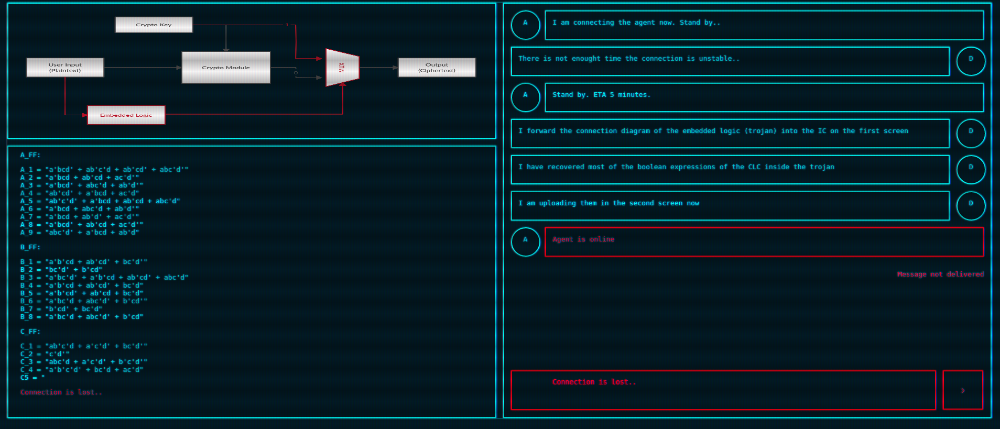
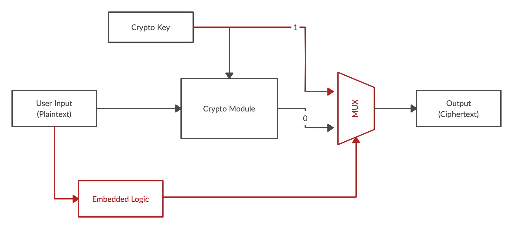
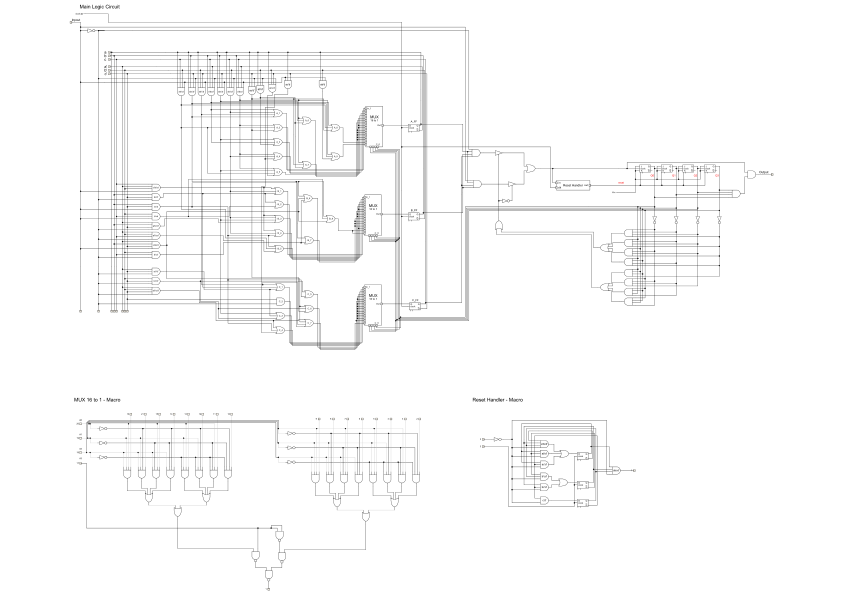
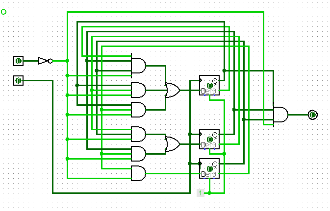
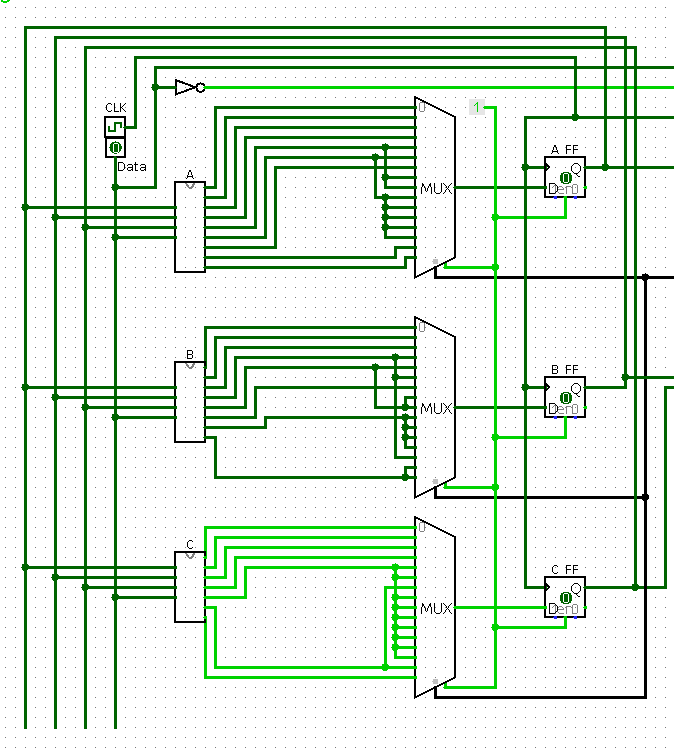
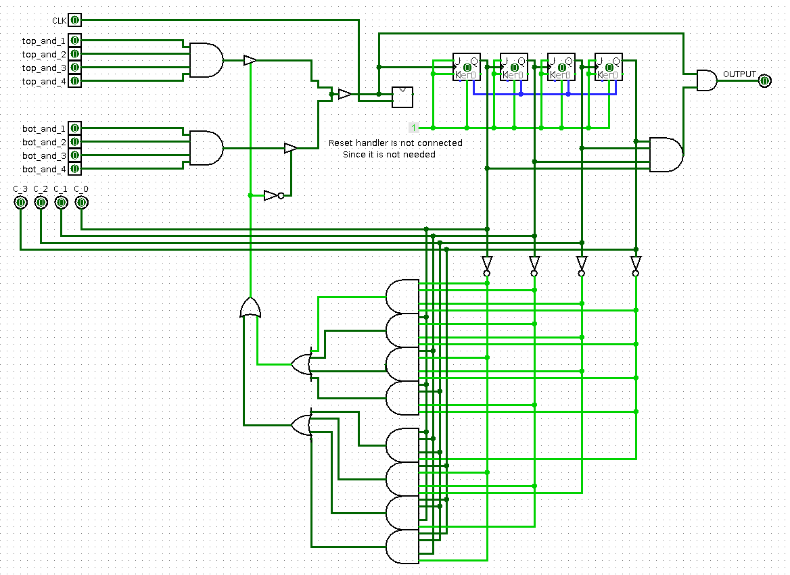
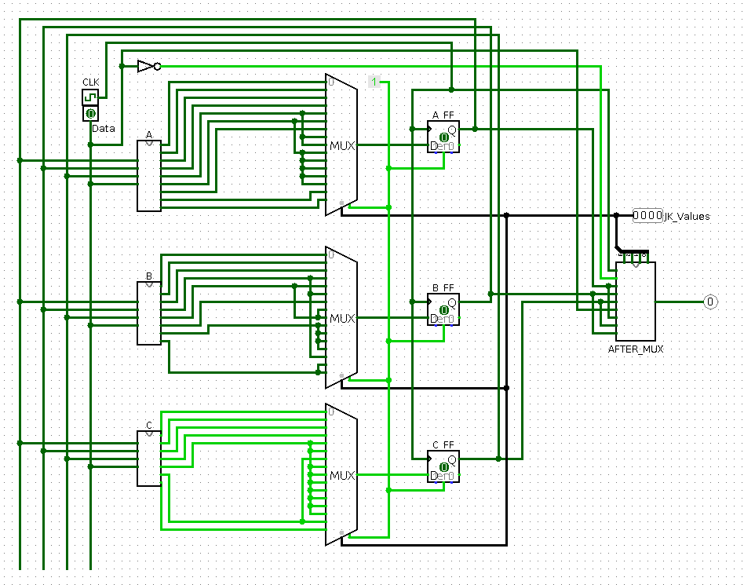
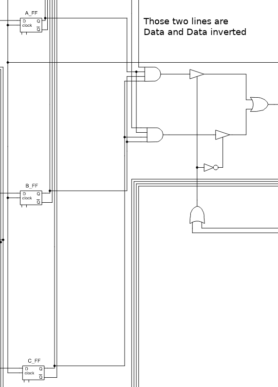

# hw_trace (HTB x Uni CTF)

## 1. Challenge information


So as we can see this is another hardware challenge ;)

**Also this challenge had only 4 solves out of ~1200 players.**

Let's get started, we have following files/images:  


From picture we see that, there is dumped block digram, some boolean expressions and it is said that they have extracted logic inside the circuit. Lets investigate from top to bottom, first block diagram.


If there was more stuff implemented from this diagram we can see that if we knew which inputs we need to give to system, then it would switch multiplexor so that we can get Crypto key from the key storage, so that is indeed a broken chip haha.

Another file that we are provided with:  

[embedded_logic_design](files/images/embedded_logic.svg) - openable svg, so it can be zoomed better.

We can see that this is indeed a logic circuit and it is quite "colorful" if you would say so. Upon checkin the dumped boolean expressions which are following:
```
A_FF:

A_1 = "a'bcd' + ab'c'd + ab'cd' + abc'd'"
A_2 = "a'bcd + ab'cd + ac'd'"
A_3 = "a'bcd' + abc'd + ab'd'"
A_4 = "ab'cd' + a'bcd + ac'd"
A_5 = "ab'c'd' + a'bcd + ab'cd + abc'd"
A_6 = "a'bcd + abc'd + ab'd'"
A_7 = "a'bcd + ab'd' + ac'd'"
A_8 = "a'bcd' + ab'cd + ac'd'"
A_9 = "abc'd' + a'bcd + ab'd"

B_FF:

B_1 = "a'b'cd + ab'cd' + bc'd'"
B_2 = "bc'd' + b'cd"
B_3 = "a'bc'd' + a'b'cd + ab'cd' + abc'd"
B_4 = "a'b'cd + ab'cd' + bc'd"
B_5 = "a'b'cd' + ab'cd + bc'd"
B_6 = "a'bc'd + abc'd' + b'cd'"
B_7 = "b'cd' + bc'd"
B_8 = "a'bc'd + abc'd' + b'cd"

C_FF:

C_1 = "ab'c'd + a'c'd' + bc'd'"
C_2 = "c'd'"
C_3 = "abc'd + a'c'd' + b'c'd'"
C_4 = "a'b'c'd' + bc'd + ac'd"
C5 = "

Connection is lost..
```
## 2. Lets get inspecting!
We can see that not all D flip-flops are not described. A_FF and B_FF are fully defined but C_FF is missing some boolean expressions. So as a first we should finish those and then continue with inspection.

```
C_5 = b'c'd + bc'd
C_6 = a'bc'd + b'c'd' + ac'd'
C_7 = abc'd' + ab'c'd + a'bc'd + a'b'c'd'

This will be used later on to build circuit and solver.
```

Now is a good idea to mention that I spent 14 good hours solving this challenge, as always if you have the flag challenge is easy ;).  
Most of my time was spent on trying to figure out what this circuit is doing and how it is behaving, so my way to inspect it was to build interactive version of it in logisim :D

For those interested logisim files are included, logisim can be downloaded: **[Logisim download](http://www.cburch.com/logisim/download.html)**  
**Logisim files inside:**  
[reset_handler](files/logisim/reset_handler.circ) - Reset handler schematic  
[after_mux](files/logisim/after_mux.circ) - Part 2 schematic  
[ABC_logic](files/logisim/ABC.circ) - Logic gates given in boolean expressions  
[final](files/logisim/final.circ) - Whole schematic linked together

This challenge could be solved without doing this and reading just from the schemating, but this is the way I went.

So lets start building, first thing I built in logisim was the reset handler, since it was smallest part of the circuit and it was also used as a box on original schematic.

Also first things first, I wasn't able to simulate the full circuit in the works in logisim due internal signal errors, which occur in simulators, cannot blame them ;) but most of functionality and way to solve this task by hand was possible (I did find flag using simulator firsthand haha, but I will provide solver script aswell I wrote up later)

## 3. Reset_handler

[logisim_reset_handler](files/logisim/reset_handler.circ)  
So lets analyze what does this part of the schematic do. First it has some logic gates and three D flipflops, for those who dont know [D-flipflop reading](http://electronics-course.com/d-flip-flop).

Anyway this circuit acts as a 3-bit counter, has two inputs and one output. Inputs are clock and active low enable/reset (kinda works like this) and output is reset signal to other components (described later on).

So with this information we can see that characters are usually 8 bits, 3-bit counter can store value up to 8 different values, sounds like a good deal. So from this we can assume that we are working with characters and they are 8 bits.

## 4. Main circutry building

Now next thing is to what to build next, upon inspecting schematic further we can see that the main logic part consists of two parts: 
1. Part with Muxes, D-flipflops, and-, or gates
2. Logic that has reset handler, two and gates before buffers and some additional JK-triggers and some additional logic.

I went on with building part 1. first. Upon looking it is awfully a lot of gates there and drawing all those in logisim would be a pain. I remembered from bachelor study times that logisim actually has combinational analysis tool which can build circuits.

So with this knowledge I could take given boolean expressions and use this function to build circuit on boolean expressions. To do this you need to select on toolbar: 
1. Window -> Combinational analysis
2. Define your input names
3. Define output names
4. Fill in the expression for all outputs
5. Press build circuit and enjoy your built circuit

I almost could use previously filled boolean expressions, only thing needed to change that multiplied values like: "abc" needed to be separated with spaces so I wrote quick python script to do that:

```python
# A_1... C_7 are previously defined strings from the website
A_FF = [A_1, A_2, A_3, A_4, A_5, A_6, A_7, A_8, A_9]
B_FF = [B_1, B_2, B_3, B_4, B_5, B_6, B_7, B_8]
C_FF = [C_1, C_2, C_3, C_4, C_5, C_6, C_7]

OR_GATES = [A_FF, B_FF, C_FF]

def add_spaces(string):
    last_char = None
    new_string = ""
    for char in string:
        if last_char == None:
            new_string += char
            last_char = char
        else:
            if last_char.isalpha() and char.isalpha():
                new_string += " " + char
            else:
                new_string += char
            last_char = char
    return new_string

for or_group in OR_GATES:
    for gate in or_group:
        print(add_spaces(gate))
```

## Circuitry part 1 building

So now I had three subcircuits which are labeled A, B, C only needed to add three 16 to 1 muxes and three D-flipflops. After some one eternity later... a monstrocity was half done.



I could have done some testing with this side also but I still didn't know enough about this circuit so I decided to make part 2. of the schematic aswell.

## Circuitry part 2 building and analysis
So lets get going, this one doesn't have boolean expressions given and doesn't have that many gates, so I got to drawing and tracing. :D Second eternity later.



This schematic uses previously drawn reset handler as a box in the middle, but it is not connected since it actually doesn't have to be to obtain the solution.

So lets get on with analyzing the circuitry...

This circuit takes 8 inputs + 1 clock input for reset handler. So those 8 inputs are separated into two AND gates. This note will become useful later on. We also see that there are two controlled buffers and those are controlled with same signal only one of them is inverted. This bascially means that there is a 2 to 1 multiplexor there. But it is done with buffers, on original schematic there is a OR gate connecting those signals but logisim didnt like floating buffer into OR gate since it leaves undefined value. So I replaced it with buffer instead, doesn't really matter in case of solving.

So next we see that there are four JK-triggers linked together, and the clock value for the first JK-Trigger comes from previous AND gates and buffers. **[JK-Trigger link for interested](https://www.electronics-tutorials.ws/sequential/seq_2.html)**.

JK-Triggers are linked to gether using output from previous trigger into next triggers clock, that creates us 4-bit downwards counter which is changed by signal that we mentioned before. This 4-bit counter holds 16 different values. This counter output is used in two places. Signals from each bit go out into circuit described in part 1. Those are selector signals for 16 to 1 muxes. Multiplexors are like switches, they have inputs and only one output, and then they have selector inputs. Which usually is given binary number to select one of the inputs to output.

This counter values are also used in logic circuit below it, which consists of AND and OR gates, and some inverters. This part of the logic is responcible for selecting which buffer is enabled.

So if we look at the bigger picture we see that depending on the value of this buffer enabler, the Counter is decreased either by lets name those AND gates to which inputs are connected to TOP_AND and BOT_AND. Lets leave this knowledge to here at the moment and lets inspect the part 1. of the circuit.

## Full circuit analysis

So combining all of the build circuit we get the full circuit.


So first thing is to figure out how those two circuits we built are connected, so looking at the schematic we can see following.
  
Second part of the circuit recives signal only IF all of the D-flipflops are HIGH (1) and the data bit from input decides, which and gate is active. This will prove useful later on.

We haven't still looked what the first part of this circuit does. Let's get to it!

First circuit has 3 D-flipflops which are used as kind of "counter" Since all of them have to be HIGH to make changes to second part where the 4-bit JK counter is, I have feeling that we this first part, changes it's states as follows, and since the 4-bit counter is applied to the MUXes, this will be some kind of mapping.

Part 2 TOP_AND and BOT_AND depend on A_FF, B_FF, C_FF in common and only difference is the Data signal, one has it inverted other not.

So combining those facts that we know so far:
1. D-flipflops ALL MUST BE HIGH to make changes in second part
2. JK-Counter is controlled either by TOP_AND or BOT_AND
3. TOP_AND and BOT_AND are dependent on DATA input
4. TOP_AND or BOT_AND is selected depending on the value of JK-Counter (logic under JK-counter)
5. 16 different counter values, 16 different MUX values
6. 8 value reset handler, 8 value part 1 counter aswell.

## Lets solve it!
We should have most things we need for solving this challenge now. I will explain first how it is done manually and later on I will describe how to solve this with programming.

### Simulation solving

We know that the flag must be in format **HTB{ins3rt_fl4g_5tuff_h3r3}**

So lets try the first input to this circuit letter "H"  
So characters must be inputed bitwise, so H is "01001000" in binary.
To input values, data must be selected either 0/1 and to input it clock cycle must be done, triggers react on rising-edge. So on transition of clock signal from 0 -> 1.

Following will describe states of Flipflops and inputed data.
1. States: A_FF: 0, B_FF: 0, C_FF: 0, Data: 0 
2. States: A_FF: 0, B_FF: 0, C_FF: 1, Data: 1 # **If we see advancements in states, this means the input bit was correct.**
3. States: A_FF: 0, B_FF: 1, C_FF: 0, Data: 0  
4. States: A_FF: 0, B_FF: 1, C_FF: 1, Data: 0  
5. States: A_FF: 1, B_FF: 0, C_FF: 0, Data: 1  
6. States: A_FF: 1, B_FF: 0, C_FF: 1, Data: 0  
7. States: A_FF: 1, B_FF: 1, C_FF: 0, Data: 0  
8. States: A_FF: 1, B_FF: 1, C_FF: 1

By now we have reached state, that we can access second part of our circuit. Since we had our data bit set to 0 upon reaching this state, this will create signal to JK-Counter and decrease it by one. Now the next state for first part D-flipflop counter is always 0. And it doesnt matter of data bit. But at this state data bit influences counter. By changing our data bit we can decrease counter. So since we tested that "H" gave us the right state changes on the D-flipflop counter. And we accessed JK-counter and decreased it. We can send our final data bit "0".
8. States: A_FF: 1, B_FF: 1, C_FF: 1, Data: 0
9. States: A_FF: 0, B_FF: 0, C_FF: 0

Since the JK-Counter jumped to "1111" or 15 in decimal. I thought that the good guess was to check input for "}" which is "01111101"
1. States: A_FF: 0, B_FF: 0, C_FF: 0, Data: 0 
2. States: A_FF: 0, B_FF: 0, C_FF: 1, Data: 1
3. States: A_FF: 0, B_FF: 1, C_FF: 0, Data: 1  
4. States: A_FF: 0, B_FF: 1, C_FF: 1, Data: 1  
5. States: A_FF: 1, B_FF: 0, C_FF: 0, Data: 1  
6. States: A_FF: 1, B_FF: 0, C_FF: 1, Data: 1  
7. States: A_FF: 1, B_FF: 1, C_FF: 0, Data: 0  
8. States: A_FF: 1, B_FF: 1, C_FF: 1, Data: 1 # Here we upon changing data bit to 1 decreases the JK counter
9. States: A_FF: 0, B_FF: 0, C_FF: 0

This proves that we need to find the right sequence of bits to input and we get the flag.

So to find out which sequence of bits is right we can do following.
On the simulation, you can always see what muxes output, is the signal HIGH or LOW before clicking the clock to actually "submit" the data bit. First seven bits can be found this way, for the last bit you have to check if upon reaching "111" in D-flipflops does the number change or not. If JK-counter decreases upon reaching it the bit is what data variable is correct one. If the number doesn't decrease, it means that data bit must be changed. This helps you to get all 8 bits of the character, and the logic works itself back to front on the flag. So as steps:

1. Get D-flipfops to state "111" by watching mux outputs.
2. To get final bit check if JK-counter decreases at "111" or data bit needs changing.
3. Repeat until flag! :o

Also if wrong input is given, D-flipflop counter always resets to 0. In real solution reset handler would be used here, to reset the JK-Trigger value to attempt the input again (but as mentioned previously it is not needed, here since on simulation we can always reset our simulation).

**Flag: HTB{7r1663333rd}**

This can be tedious way to solve this problem so lets show way how to solve this with code!


### Programmatic solving

To solve this programmatically we need realise two parts of the logic schematics as code:  
1. D-flipflop logic (given in boolean expressions)
2. Check for the last bit (counter value into logic gates below it)

Let's get coding!

```python
# First of all I wrote quick parser for boolean expressions in given format, which gives us python exectuable code what we can copy paste

def parse_boolean_to_python(expression, output_variable_name):
    # Parses boolean expression into python executable code
    expression = expression.replace(" ", "")
    new_python_expression = ""

    last_char = None
    or_was_used = False
    and_needed = False
    for char_index, char in enumerate(expression):
        if last_char == None:
            last_char = char
        else:
            # Deal with inversion
            if char == "'":
                new_python_expression += "not " + last_char
                
                # Ignore index error, since it is last character anyway
                try:
                    if expression[char_index + 1] != "+":
                        and_needed = True 
                except IndexError:
                    pass

            
            elif last_char.isalpha() and not or_was_used:
                new_python_expression += last_char
                if char != "+":
                    and_needed = True

            elif last_char.isalpha() and or_was_used:
                new_python_expression += last_char
                or_was_used = False
                if char != "+":
                    and_needed = True

            elif last_char == "+":
                new_python_expression += ") or ("
                or_was_used = True


            if and_needed:
                new_python_expression += " and "
                and_needed = False
            last_char = char

    
    new_python_expression = "(" + new_python_expression + ")"
    return output_variable_name + " = " + new_python_expression

# Our given boolean expressions
A_1 = "a'bcd' + ab'c'd + ab'cd' + abc'd'"
A_2 = "a'bcd + ab'cd + ac'd'"
A_3 = "a'bcd' + abc'd + ab'd'"
A_4 = "ab'cd' + a'bcd + ac'd"
A_5 = "ab'c'd' + a'bcd + ab'cd + abc'd"
A_6 = "a'bcd + abc'd + ab'd'"
A_7 = "a'bcd + ab'd' + ac'd'"
A_8 = "a'bcd' + ab'cd + ac'd'"
A_9 = "abc'd' + a'bcd + ab'd"


B_1 = "a'b'cd + ab'cd' + bc'd'"
B_2 = "bc'd' + b'cd"
B_3 = "a'bc'd' + a'b'cd + ab'cd' + abc'd"
B_4 = "a'b'cd + ab'cd' + bc'd"
B_5 = "a'b'cd' + ab'cd + bc'd"
B_6 = "a'bc'd + abc'd' + b'cd'"
B_7 = "b'cd' + bc'd"
B_8 = "a'bc'd + abc'd' + b'cd"


C_1 = "ab'c'd + a'c'd' + bc'd'"
C_2 = "c'd'"
C_3 = "abc'd + a'c'd' + b'c'd'"
C_4 = "a'b'c'd' + bc'd + ac'd"
C_5 = "b'c'd' + bc'd"
C_6 = "a'bc'd + b'c'd' + ac'd'"
C_7 = "abc'd' + ab'c'd + a'bc'd + a'b'c'd'"

# Lists of boolean expressions, also given their names
A_FF = [A_1, A_2, A_3, A_4, A_5, A_6, A_7, A_8, A_9]
A_FF_names = ["A_1", "A_2", "A_3", "A_4", "A_5", "A_6", "A_7", "A_8", "A_9"]
B_FF = [B_1, B_2, B_3, B_4, B_5, B_6, B_7, B_8]
B_FF_names = ["B_1", "B_2", "B_3", "B_4", "B_5", "B_6", "B_7", "B_8"]
C_FF = [C_1, C_2, C_3, C_4, C_5, C_6, C_7]
C_FF_names = ["C_1", "C_2", "C_3", "C_4", "C_5", "C_6", "C_7"]

# List of lists, to make looping easier
OR_GATES = [A_FF, B_FF, C_FF]
OR_GATES_names = [A_FF_names, B_FF_names, C_FF_names]

## Uncomment for generation of next function 

# for gates, names in zip(OR_GATES, OR_GATES_names):
#     print()
#     for expression, name in zip(gates, names):
#         print(parse_boolean_to_python(expression, name))
    
# This outputs us the whole boolean system which we can use to compute values
# lets define the D-flipflop part

# So we need to define function that solves our system for certain mux selector
# function will have 5 inputs, a, b, c, d and mux index.
def calculate_function_values(a, b, c, d, mux_index):
    # Here we copy paste our python executable code which is generated by previous code
    A_1 = (not a and b and c and not d) or (a and not b and not c and d) or (a and not b and c and not d) or (a and b and not c and not d)
    A_2 = (not a and b and c and d) or (a and not b and c and d) or (a and not c and not d)
    A_3 = (not a and b and c and not d) or (a and b and not c and d) or (a and not b and not d)
    A_4 = (a and not b and c and not d) or (not a and b and c and d) or (a and not c and d)
    A_5 = (a and not b and not c and not d) or (not a and b and c and d) or (a and not b and c and d) or (a and b and not c and d)
    A_6 = (not a and b and c and d) or (a and b and not c and d) or (a and not b and not d)
    A_7 = (not a and b and c and d) or (a and not b and not d) or (a and not c and not d)
    A_8 = (not a and b and c and not d) or (a and not b and c and d) or (a and not c and not d)
    A_9 = (a and b and not c and not d) or (not a and b and c and d) or (a and not b and d)

    B_1 = (not a and not b and c and d) or (a and not b and c and not d) or (b and not c and not d)
    B_2 = (b and not c and not d) or (not b and c and d)
    B_3 = (not a and b and not c and not d) or (not a and not b and c and d) or (a and not b and c and not d) or (a and b and not c and d)
    B_4 = (not a and not b and c and d) or (a and not b and c and not d) or (b and not c and d)
    B_5 = (not a and not b and c and not d) or (a and not b and c and d) or (b and not c and d)
    B_6 = (not a and b and not c and d) or (a and b and not c and not d) or (not b and c and not d)
    B_7 = (not b and c and not d) or (b and not c and d)
    B_8 = (not a and b and not c and d) or (a and b and not c and not d) or (not b and c and d)

    C_1 = (a and not b and not c and d) or (not a and not c and not d) or (b and not c and not d)
    C_2 = (not c and not d)
    C_3 = (a and b and not c and d) or (not a and not c and not d) or (not b and not c and not d)
    C_4 = (not a and not b and not c and not d) or (b and not c and d) or (a and not c and d)
    C_5 = (not b and not c and not d) or (b and not c and d)
    C_6 = (not a and b and not c and d) or (not b and not c and not d) or (a and not c and not d)
    C_7 = (a and b and not c and not d) or (a and not b and not c and d) or (not a and b and not c and d) or (not a and not b and not c and not d)
    
    # Yeah sure it looks ugly but what can you do :P computers are ugly inside.
    # Now we need to define MUX tables I use lists to do that, those are read from schematic
    A_MUX = [A_1, A_2, A_3, A_4, A_5, A_6, A_7, A_5, A_5, A_6, A_6, A_6, A_6, A_6, A_8, A_9]
    B_MUX = [B_1, B_2, B_3, B_4, B_5, B_4, B_6, B_5, B_5, B_7, B_7, B_7, B_7, B_4, B_8, B_8]
    C_MUX = [C_1, C_2, C_3, C_4, C_5, C_5, C_6, C_5, C_5, C_5, C_5, C_5, C_5, C_5, C_6, C_7]

    # Those are our boolean expression outputs, those are selected by mux index or JK-Counter in schematic
    D_1 = A_MUX[mux_index]
    D_2 = B_MUX[mux_index]
    D_3 = C_MUX[mux_index]

    # So there we have our three D-flipflops now, we need to output our calculated state
    # I here decided to output the value as integer
    
    # So our function returns value of the calculated state our circuit will be, depending on the inputs
    return (D_1 << 2) | (D_2 << 1) | D_3
    
# Now we have programmed our first part, second part remains
def last_bit_check(mux_index):
# So this function basically checks, what has the last data bit to be, depending on the logic circuit state.
# Remember in description were those two AND gates called TOP_AND and BOT_AND
# This basically checks which one needs to be used to change the JK-counter value
    JK = mux_index
    JK_bits = [((JK >> 3) & 1), ((JK >> 2) & 1), ((JK >> 1) & 1), (JK & 1)]
    # Bits are reversed on schematic so we have to reverse the bit list
    JK_bits = JK_bits[::-1]

    # So lets build our schematic in code first we have layer of AND gates, which inputs are taken from JK-Counter

    buffer_and_1 = not JK_bits[0] and not JK_bits[1] and not JK_bits[2] and not JK_bits[3] # check
    buffer_and_2 = JK_bits[0] and not JK_bits[1] and not JK_bits[2] and not JK_bits[3] # check 
    buffer_and_3 = not JK_bits[0] and JK_bits[1] and not JK_bits[2] and not JK_bits[3]
    buffer_and_4 = JK_bits[0] and not JK_bits[1] and JK_bits[2] and not JK_bits[3]
    buffer_and_5 = JK_bits[0] and JK_bits[1] and JK_bits[2] and not JK_bits[3]
    buffer_and_6 = not JK_bits[0] and not JK_bits[1] and not JK_bits[2] and JK_bits[3]
    buffer_and_7 = JK_bits[0] and not JK_bits[1] and JK_bits[2] and JK_bits[3]
    buffer_and_8 = not JK_bits[0] and JK_bits[1] and JK_bits[2] and JK_bits[3]

    # Next layer of gates are OR gates

    counter_or_1 = buffer_and_1 or buffer_and_2 or buffer_and_3 or buffer_and_4
    counter_or_2 = buffer_and_5 or buffer_and_6 or buffer_and_7 or buffer_and_8

    # And the final or gate

    buffer_or = counter_or_1 or counter_or_2

    return buffer_or

# We have build all necessary parts in code to get our flag
# First since our data will be in binary, lets create list for flag characters where binary data will be
flag_characters = []

# Since we have established that there are 16 letters in our flag we need to loop 16 times
for flag_letter_index in range(16):
    # Create empty string for binary values
    character = ""
    # We know that each letter consists of 8 bit values we need to find
    for which_bit_counter in range(8):
        # Generate state inputs from which bit counter

        a = (which_bit_counter >> 2) & 1
        b = (which_bit_counter >> 1) & 1
        c = which_bit_counter & 1
        
        # There are two possible values for the data bit, one which will be right
        for d in range(2):
            # calculate_function_values returns us new state in integer value, 
            next_state = calculate_function_values(a, b, c, d, flag_letter_index)
            # if next_state is 0 we know that bit was wrong, if next_state returns anything else than 0, we know bit is right
            if next_state:
                character += str(d)
            # figure out the last bit, last bit has different code since it depends on the second part of our circuit we realised in program
            # this is because, last state retuns 0 to any data bits since D-flipflop counter resets
            if next_state == 7:
                # those bit values are figured out from which of TOP_AND or BOT_AND needs to be active to decrease the counter
                # upon lookin schematic we see that, if buffer_or is high, then TOP_AND needs to be used
                # TOP_AND has data inverted connected to it
                # BOT_AND has data connected to it
                # Data (d) needs to be 0 for TOP_AND to be active
                # Data (d) needs to be 1 for TOP_AND to be active
                character += "0" if last_bit_check(flag_letter_index) else "1"
    # If our loop has gone over all bits, append bits to our flag list
    flag_characters.append(character)

# If all is done correctly we should finally decode our binary characters into flag :p

for character in flag_characters:
    print(chr(int(character, 2)), end='')
print()

# And finally we have our flag!
HTB{7r1663333rd}

```

I gotta admit that those hours spent solving this challenge were well spent.  

Hope you liked the write-up and guys solve HW challenges!