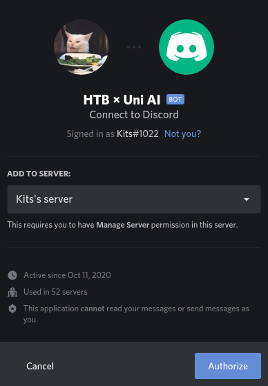

# HTBxUni AI


There is a rouge bot on the server and we need to find ways to communicate with it. First of all this bot is only in one of the channels and this channel is muted (noone can send messages).

So let's try to direct message the bot on discord.  


We can see that the DMs are disabled, so we must find another way. I was thinking what other ways could be... after some brainstorming I came to the idea that discord bots can be invited to other channels, lets do a quick google search and find out how bots can be invited.
[Invite bot to your channel](https://discordjs.guide/preparations/adding-your-bot-to-servers.html#bot-invite-links)

So we can see from there that to invite bot you need to use bot invite link which looks as following:

```
https://discord.com/oauth2/authorize?client_id=<bot_id>&scope=bot
```

Bot id can be found by right clicking profile of the bot in Discord and clicking Copy ID.

ID for this bot: **764609448089092119**

Also you need to be channel owner to invite bots (or need sufficient permissions)

```
https://discord.com/oauth2/authorize?client_id=764609448089092119&scope=bot
```

Opening this link will provide you with following:  


So now we have bot in our server:  


Lets try shutting the bot down.  


So we need to be administrator. I got the idea that I should make role named Administrator in discord and then try again.


Lets try shutdown again, maybe bot will listen to me now since I am teh administrator.


And there we have it, we have made bot to submit to our massive powers.