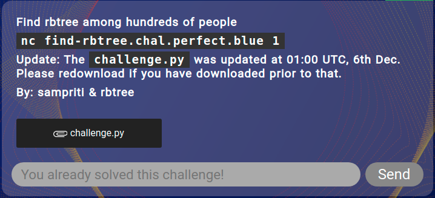
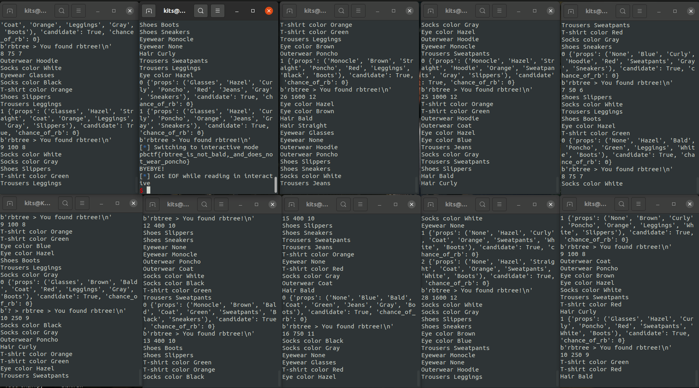

# Find rbtree (PBCTF 2020)
Category: Misc, ppc



Files: [challenge.py](files/challenge.py)

Firstly, the game is similar to "Guess Who?" game where you have to guess who is the selected person by asking various properties about the person. You can have answers Yes or No only.

Upon inspecting the challenge source code we can see that game consists of 30 different stages.

```python
def main():
    print(welcome) # Prints welcome ascii art

    # Definitons of different cases, so first in tuple is number of people
    # and second one is number of questions we are allowed to ask
    cases = [(5, 3), (7, 3), (10, 4), (15, 4), (20, 5), (25, 5), (50, 6), (75, 7), (100, 8), (250, 9)]
    cases += [(400, 10)] * 5 + [(750, 11)] * 5 + [(1000, 12)] * 5 + [(1600, 12)] * 5

    # Totaling 30 cases 

    # Stage is the function where the people generation and game logic lies
    for idx, (num_people, num_ask) in enumerate(cases):
        if not stage(idx + 1, num_people, num_ask):
            print("WRONG :(")
            return
        print("You found rbtree!")

    # If you complete all cases sucessfully we will get the flag printed to us
    with open("flag.txt", "r") as f:
        print(f.read())


if __name__ == "__main__":
    try:
        main()
    finally:
        print("BYEBYE!")
        exit(0)
```

So lets investigate the stage function.
```python
# This is where possible properties we can ask are defined
prop = {
    "Eyewear": ["Glasses", "Monocle", "None"],
    "Eye color": ["Brown", "Blue", "Hazel"],
    "Hair": ["Straight", "Curly", "Bald"],
    "Outerwear": ["Coat", "Hoodie", "Poncho"],
    "T-shirt color": ["Red", "Orange", "Green"],
    "Trousers": ["Jeans", "Leggings", "Sweatpants"],
    "Socks color": ["Black", "Gray", "White"],
    "Shoes": ["Boots", "Slippers", "Sneakers"],
}


def stage(num_stage, num_people, num_ask):
    print("STAGE {} / 30".format(num_stage))
    print("Generating people... (and rbtree)")

    # Generation of people, and selecting rbtree to be one of the people
    people = list(itertools.product(*prop.values()))
    random.shuffle(people)
    people = people[:num_people]
    rbtree = random.choice(people)

    print("=" * 29)
    # This prints out every person and their properties
    for idx, person in enumerate(people):
        print(" ".join(" [PERSON {:4d}] ".format(idx + 1)))
        for prop_name, prop_val in zip(prop.keys(), person):
            print("{:14s}: {}".format(prop_name, prop_val))
        print("=" * 29)

    print("Now ask me!")

    # Asking for user input, user can either guess who the person is or ask question
    # about if rbtree has any of the upper properties

    for i in range(num_ask):
        prop_name = input("? > ")
        # 'Solution' gets us to guessing who rb is (*)
        if prop_name == 'Solution':
            break
        # This checks if asked property exists in prop dict
        if prop_name not in prop:
            return False
        
        # Prompts user for certain property to be asked:
        # "Does rbtree have Glasses?"
        prop_ask = input("! > ").strip().split(' ')
        for val in prop_ask:
            if val not in prop[prop_name]:
                return False

        # If rbtree has property answer is yes, else no
        if set(rbtree) & set(prop_ask):
            print("YES")
        else:
            print("NO")

    # (*) This is the place where user has to tell game which properties does rbtree posess.
    # In a form of "Glasses Blue Curly Coat Red Jeans Black Boots"
    rbtree_guess = tuple(input("rbtree > ").strip().split(' '))

    # If guess is right we get to next stage with more people otherwise, game fails
    if rbtree == rbtree_guess:
        return True
    else:
        return False
```

So that is first analysis of the source code done. Let's get solving! First of all I started testing my solver offline, since online service had timing delays (in my opinion).

To run challenge locally you can use ncat with following command:
```bash
ncat -lvp 1234 -e "/usr/bin/python3 challenge.py"
```
This will create listener on port 1234 and serve the python script as connection handler.

Solver script:
```python
# Let's use pwntools functionallity to send and recive data over tcp
from pwn import *
# Commented out the remote connection to online service due to local testing
# r = remote('find-rbtree.chal.perfect.blue', 1)
# Create connection to service
r = remote('localhost', 1234)

# To solve this challenge, we need a person information parser, 
# which would get us the information about people generated and make it programmable.
def get_person_info(r):
    # Eats up data until "]"
    r.recvuntil("]")
    # There was additional line which needed to be handled
    _ = r.recvline()

    head_wear = str(r.recvline()).split(": ")[1][:-3]
    eye_color = str(r.recvline()).split(": ")[1][:-3]
    hair = str(r.recvline()).split(": ")[1][:-3]
    outerwear = str(r.recvline()).split(": ")[1][:-3]
    t_shirt_color = str(r.recvline()).split(": ")[1][:-3]
    trousers = str(r.recvline()).split(": ")[1][:-3]
    socks = str(r.recvline()).split(": ")[1][:-3]
    shoes = str(r.recvline()).split(": ")[1][:-3]

    # Pack person properties and information into dictionary
    person = {
        'props' : (head_wear, eye_color, hair, outerwear, t_shirt_color, trousers, socks, shoes),
        'candidate' : True, # If person is candidate for rbtree or not
        'chance_of_rb' : 0 # This was not used in implementation 
        #(probably could do some probability theory shenaningans here)
    }

    return person

# Print and return valid candidate person indexes from remaining people
def show_people_left(people_left):
    valid_indexes = []
    for id, person in enumerate(people_left):
        # If candidate flag is True person can be rbtree
        if person['candidate'] == True:
            print(id, person)
            valid_indexes.append(id)
    return valid_indexes

# Next we import some data we can use from challenge source code
# All possible categories of properties and possible properties as well
properties = {
    "Eyewear": ["Glasses", "Monocle", "None"],
    "Eye color": ["Brown", "Blue", "Hazel"],
    "Hair": ["Straight", "Curly", "Bald"],
    "Outerwear": ["Coat", "Hoodie", "Poncho"],
    "T-shirt color": ["Red", "Orange", "Green"],
    "Trousers": ["Jeans", "Leggings", "Sweatpants"],
    "Socks color": ["Black", "Gray", "White"],
    "Shoes": ["Boots", "Slippers", "Sneakers"],
}
# (number_of_people, number_of_questions_allowed) in tuple
cases = [(5, 3), (7, 3), (10, 4), (15, 4), (20, 5), (25, 5), (50, 6), (75, 7), (100, 8), (250, 9)]
cases += [(400, 10)] * 5 + [(750, 11)] * 5 + [(1000, 12)] * 5 + [(1600, 12)] * 5

# 30 total cases

# Make tuple of property category names for ease of use
category_names = tuple(properties.keys())

# Actual game solver starts from here
# First we have 30 stages we need to solve
for stage in range(30):
    # Eat all recieved data until STAGE marker
    r.recvuntil("STAGE ")
    stage = str(r.recvline()).split(' / ')[0][2:]
    # Parse stage number and assign values from cases list
    people_count, question_count = cases[int(stage) - 1]
    print(stage, people_count, question_count)

    # Gather all information about generated people
    people = []
    for person in range(people_count):
        people.append(get_person_info(r))

    # Now we will have list of all people generated with their properies

    # Now the game provides us with asking the questions
    for question_counter in range(question_count):
        # every question will reduce amound of people left
        people_left = []
        for person in people:
            if person['candidate']:
                people_left.append(person)

        # Now to make best questions about rbtree we can get the distributions
        # of different properties so first we have to count all of the properties in
        # each of the categories
        prop_distribution = {}

        # This could be probably counted in more sophicsticated way
        # Go over each of the prop categories
        for category in category_names:
            prop_distribution[category] = {} # create an empty dictionary
            # Loop over properties of each category
            for prop in properties[category]:
                # Go over each person left
                for person in people_left:
                    # Go over each person's properties
                    for person_prop in person['props']:
                        # Count actual properties
                        if prop == person_prop:
                            try:
                                # Increment count because it was found
                                prop_distribution[category][prop] += 1
                            except KeyError:
                                # Case where prop is not in dict
                                prop_distribution[category][prop] = 1
                                

        # Now we need some place to hold our best choice for question
        best_choice = {
            'category' : "Unknown", # This is placeholder value for initialization
            'prop' : "Unknown", # Same as previous
            'value' : 0.5, # Since we are looking for 0.5 distribution initialize it with 0.5
            'amount_of_choices' : 3 # This is the worst case scenario will be relevant later
        }

        # Following code will find the best choice for our question
        # Idea behind that is to get rid of 50% of the choices we have

        # Loop over all 8 categories
        for category in prop_distribution.keys():
            print(category, prop_distribution[category], end=' ')
            ## Loop over items to get their distribution
            for distribution in prop_distribution[category].keys():
                
                # Now we are calculating distribution value of our item
                # count_of_items / total_people_left
                distribution_value = prop_distribution[category][distribution] / len(people_left)
                # Amount of choices, possible values (3, 2, 1) like:
                # ("Boots", "Slippers", "Sneakers") or ("Boots", "Slippers") or ("Boots")
                amount_of_choices = len(prop_distribution[category])
                # Difference from 0.5
                # Meaning the smaller the difference the better choice it is
                difference = abs(0.5 - distribution_value)
                
                # Assign best choice # Distrtibution value 1 means no choice there
                if best_choice['value'] >= difference and distribution_value != 1:
                    # Priortize 2 choices over 3
                    if len(prop_distribution[category]) <= best_choice['amount_of_choices']:
                        best_choice['value'] = difference
                        best_choice['category'] = category
                        best_choice['prop'] = distribution
                        best_choice['amount_of_choices'] = len(prop_distribution[category])

                print(distribution_value, end=' ')
            print()
        
        # After this we have our best choice for this question round, which will get rid of
        # Most of the false answers to which person is rbtree
        # After we have our best choice ready we gotta ask the question and handle it
        # If it is the first question game will present us with line "Now ask me!"
        # So we gotta eat this input
        if question_counter == 0:
            r.recvuntil("Now ask me!\n")

        # IF best_choice = "Unknown", person is detected already, present solution
        # This is why best_choice is defined with inital unknown value
        # This case happens if questions seperate person before running out of
        # All questions, sometimes it happens so it must be handled
        if best_choice['category'] != 'Unknown':

            # Game requires you to send two different lines, first you have to say that
            # which of the category are you asking
            # and secondly which prop are you asking on from that category
            selected_category = best_choice['category']
            r.sendline(selected_category)
            selected_prop = best_choice['prop']
            r.sendline(selected_prop)
            print(selected_category, selected_prop)
            # Game will respond with YES OR NO, code parses just the first letter from answer
            # so responce will be either Y or N
            response = str(r.recvline()).split("> ")[2][0]

        # Send solution straight away
        else:
            r.sendline("Solution")
            break

        # Handle the answer to our question and mark people who are no longer
        # candidates for our solution
        for person in people_left:
            if response == "Y":
                # If question was Y to our question, means that person has the prop
                # We asked about, mark all other who do not have it to be
                # out of the selection
                if person['props'][category_names.index(selected_category)] != selected_prop:
                    person['candidate'] = False
                # Case if person does not have questioned prop
            else:
                if person['props'][category_names.index(selected_category)] == selected_prop:
                    person['candidate'] = False

    # Now that we have ran out of questions or we have only one person left
    # We must guess which of the people is rbtree
    # Get possible choices usually you have only one left
    which_is_rb = show_people_left(people_left)

    # If not one, pray to RNG jesus and hope for the BEST
    # this is due to the challenge, sometimes there will be tie at the ending
    # if you got unlucky asking questions and people were generated in bad 
    # distributions you dont have always have enough questions to zero out the right one
    # So you will be left with two
    rb_index = random.choice(which_is_rb)

    # Send answer
    # Answer is props rbtree has seperated with spaces, described earlier in
    # game analysis
    r.sendline(" ".join(people_left[rb_index]['props']))

    # Eat some text: was your guess right or wrong
    # on wrong guess game stops
    print(r.recvline())
    # If you guess right we go to next stage and keep on questioning and guessing!

# Switch to interactive mode to get the flag after 30 stages are solved
r.interactive()
```

With this solver there is sometimes a chance, that you are left with a tie and random person is selected, to get over this issue I ran multiple solvers at the same time.

Amount I used was eight, eventually one of the solvers due to good luck with RNG got right person selected at ties.

And here is the precious flag:
```
pbctf{rbtree_is_not_bald,_and_does_not_wear_poncho}
```

This is how solving the challenge looked like, first row second window terminal has reached end.


Probably this solution can be made better with using probabliy theory with some Bayesian stuff, since we learn new information with every question.
