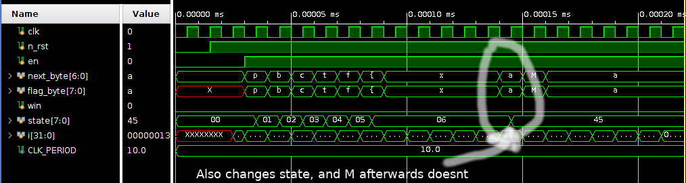

# Otsupeko (pbctf 2020) 

## Description
This is another HW challenge, I didn't manage to solve it on the CTF due to not being on my PC and not having right tools, was too lazy to install those. Although solved it later after CTF had ended and decided to do write-up since none were available.


As the challenge description says, prepare yourselves for fake flags!

## Files
Files included in challenge:  
[README](files/README) - Gives valuable information  
[challenge.v](files/challenge.v) - Verilog file for challenge module  
[tb_challenge.sv](files/tb_challenge.sv) - SystemVerilog file for describing testbench for challenge 

## Intro
First of all, let's see what we are dealing with.  
Verilog is a hardware description language, basically you are able to describe hardware (digital logic) either behaviourally (how it behaves) just like programming if/else clauses etc.

Another way is to describe it structurally (logic gate level) with different digital logic elements and gates.

With those descriptions you can run simulations, synthesize real schematics for FPGAs or overall make your own chips. 

This challenge will use simulation part heavily.

## File analysis
Alright let's dive into it. We have [README](files/README) file which states following:
```
At least it's not bitstream or standard cell ASIC.

Stdcell lib: OSU ami05

- Challenge author: voidmercy
```

Next we have [challenge.v](files/challenge.v) file which describes the structure of the logic we need to use to get the flag(s, alot of them)...

```verilog
// this declares module can be thought as of functions in programming
module challenge ( clk, n_rst, en, next_byte, win );
  // altho parameters work abit differently but you can still think of them as functions
  // in C outputs would be similar to pointers, since you can have multiple outputs
  // In HDL (hardware description languages) those are called ports
  
  // This section describes inputs and outputs
  // [6:0] describes that we use 7 bit wide bitstring, basically array of bits.
  // other signals are 1 bit.
  input [6:0] next_byte;
  input clk, n_rst, en;
  output win;

  // Those are internal signals, signals can be thought as of local variables
  wire   n1234, n1236, n1238, n1240, n1242, n1244, n1246, n1248, n1250, n1251,
         n1252, n1253, n1254, n1255, n1256, n1257, n1258, n1259, n1260, n1261,
         n1262, n1263, n1264, n1265, n1266, n1267, n1268, n1269, n1270, n1271,
         n1272, n1273, n1274, n1275, n1276, n1277, n1278, n1279, n1280, n1281,
         n1282, n1283, n1284, n1285, n1286, n1287, n1288, n1289, n1290, n1291,
         n1292, n1293, n1294, n1295, n1296, n1297, n1298, n1299, n1300, n1301,
         n1302, n1303, n1304, n1305, n1306, n1307, n1308, n1309, n1310, n1311,
        // Alot of variables defined more in file just making it shorter
  wire   [7:0] state;

  // Like in programming functions can call other functions, in HDL things happen
  // in paralle or they can happen also sequencially

  // Anyway here are defined different modules, now comes the hint useful since
  // Files do not include definitions for those modules (functions)

  // If we would try to compile this file with Verilog compilator we would get 
  // errors about missing definitions of modules.

  // Those modules are D-Flip-Flops, they are used as memory in this schematic
  // Those follow same logic as in testbench description you assign signals to
  // inputs and outputs.
  DFFSR \state_reg[0]  ( .D(n1248), .CLK(clk), .R(n_rst), .S(1'b1), .Q(
        state[0]) );
  DFFSR \state_reg[1]  ( .D(n1246), .CLK(clk), .R(n_rst), .S(1'b1), .Q(
        state[1]) );
  DFFSR \state_reg[3]  ( .D(n1244), .CLK(clk), .R(n_rst), .S(1'b1), .Q(
        state[3]) );
  DFFSR \state_reg[7]  ( .D(n1242), .CLK(clk), .R(n_rst), .S(1'b1), .Q(
        state[7]) );
  DFFSR \state_reg[6]  ( .D(n1240), .CLK(clk), .R(n_rst), .S(1'b1), .Q(
        state[6]) );
  DFFSR \state_reg[5]  ( .D(n1238), .CLK(clk), .R(n_rst), .S(1'b1), .Q(
        state[5]) );
  DFFSR \state_reg[4]  ( .D(n1236), .CLK(clk), .R(n_rst), .S(1'b1), .Q(
        state[4]) );
  DFFSR \state_reg[2]  ( .D(n1234), .CLK(clk), .R(n_rst), .S(1'b1), .Q(
        state[2]) );

  // Different blocks are used here, will bring examples later on.
  // Those follow same logic as in testbench description you assign signals to
  // inputs and outputs.
  BUFX2 U1252 ( .A(n2062), .Y(n1250) );
  AND2X2 U1253 ( .A(n1633), .B(n1250), .Y(n1963) );
  INVX2 U1254 ( .A(n2185), .Y(n1251) );
  INVX2 U1255 ( .A(n1254), .Y(n1678) );
  INVX2 U1256 ( .A(n2116), .Y(n1252) );
  AND2X2 U1257 ( .A(n2072), .B(n1252), .Y(n2355) );
  AND2X2 U1258 ( .A(n1922), .B(n1252), .Y(n1930) );
  INVX2 U1259 ( .A(n1451), .Y(n1414) );
  INVX2 U1260 ( .A(n1637), .Y(n1633) );
  INVX2 U1261 ( .A(n2406), .Y(n1601) );
  INVX2 U1262 ( .A(n2440), .Y(n1986) );
  INVX2 U1263 ( .A(n1800), .Y(n1982) );
  NOR2X1 U1264 ( .A(n1253), .B(n1254), .Y(win) );
  OR2X1 U1265 ( .A(n1255), .B(n1256), .Y(n1248) );
    //...  This file continues for many many lines
endmodule

```

Finally we have [tb_challenge.sv](files/tb_challenge.sv) this file is used for simulation and giving instructions to digital logic we have in the first file. TB stands for test-bench which it quite literally is. With this file you can programatically give your circuit inputs and see what is going inside of the circuit.


```verilog
// Describes timescale of the testbench
`timescale 1ns/10ps

// Coding goes similarily to last file we had.
module tb_challenge ();
    // Those now are obserable signals, which we can measure/maniupulate during simulation
	reg clk;
	reg n_rst;
	reg en;
	reg[6:0] next_byte;
	reg[7:0] flag_byte;
	reg win;

    // This describes clock period of the testbench, how often to flick the clock signal
	localparam CLK_PERIOD = 10ns;

    // Here we have the first fake flag, this will actually be used as placeholder for real flag later on
	string flag = "pbctf{AHOY_PEKO_PEKO_shaak_nanodesu}";

    // Here we initiate our defined module from challenge.v
    // When functions are called, in HDL modules are initated and signals (variables) are
    // assigned to different ports of module.
    // This ties testbench signals, which we can control and measure with module's inputs
    // and outputs
	challenge CHAL (.clk(clk), .n_rst(n_rst), .en(en), .next_byte(next_byte), .win(win));

    // HDL is weird like that, code can be ran in parallel, think of multiprocessing
    // This always is just like while True loop that is running on the background
    // It will toggle the clk signal every CLK_PERIOD / 2
	always begin
		clk = 1'b0;
		#(CLK_PERIOD / 2.0);
		clk = 1'b1;
		#(CLK_PERIOD / 2.0);
	end

    // This is an integer variable, this holds letter intex from the flag.
	integer i;


    // Initial keyword starts the initialization of the simuilation, basically it is another "program being run"
	initial begin
        // Initialization of different signal values
        // disable our module
		en = 1'b0;
        // set the next_byte to 0
		next_byte = 7'b0000000;
        // Reset the challenge module to it's first state.
		n_rst = 1'b0;
        // delay 1 clock cycle
		@(negedge clk);
		@(posedge clk);
		n_rst = 1'b1;
        // delay 1 clock cycle
		@(negedge clk);
		@(posedge clk);

        // This part exactly like for loops in programming do.
        // verilog uses begin and end as { and }. 
        // This loop will go over flag characters given in flag variable,
        // and give each letter as binary input to challenge module which will
        // act on the input signals.
		for (i = 0; i < flag.len(); i = i + 1) begin
            // Do everything at the falling edge of clockcycle (synchronisation)
			@(negedge clk);
            // Take character into flag_byte signal
			flag_byte = flag[i];
            // Assign it to next byte, 7 bytes are only used, since ascii has 8th bit,
            // as 0 anyway
			next_byte = flag_byte[6:0];
            // write enable high, just to ensure that module is enabled.
			en = 1'b1;
		end

        // If we are done with flag, disable module
		@(negedge clk);
		en = 0;
        // Check win signal, if it is high (1) we check following
		if (win == 1'b1) begin
            // If flag is of length 49, this is the correct flag, this is useful clue here
			if (flag.len() != 49) begin
				$display("Close!!!"); // say that we are correct
			end else begin
				$display("Correct!"); // troll us and say that we have false flag ;)
			end
		end else begin
			$display("BUUBUUUUUUU DESU WA"); // Just trashtalk to challenge solver 
		end
		$finish;
	end
endmodule
```

## Setup

Now we have gone over what we are dealing with and what we have is following:  
* definition of the digital logic
* testbench to check if our flag is right
* README with some additional information

From here we have a clue for what library is used to describe blocks in the [challenge.v](files/challenge.v) file. I have some previous experience with Vivado development suite, it is free suite for students. Although you could use any verilog compiler + simulator ([Icarus Verilog](http://iverilog.icarus.com/)), but since I had previous experience I used Vivado.

So first thing that we need to do to get the simulation working is to look for the library which is used to define the blocks (DFFSR, OR2X1 etc..) in code.

Library is named: OSU_ami05.
Upon googling: "osu_ami05 verilog" we can find some links that it is used in Cadence.

After a while I stumbled upon a link which leads to directory of Oklahoma State University.  
[Index of /flows/MOSIS_SCMOS/latest/cadence/lib/ami05](https://vlsiarch.ecen.okstate.edu/flows/MOSIS_SCMOS/latest/cadence/lib/ami05/)

In this directory we can find directory called lib and inside of that we will have  
[osu05_stdcells.v](https://vlsiarch.ecen.okstate.edu/flows/MOSIS_SCMOS/latest/cadence/lib/ami05/lib/osu05_stdcells.v)

This describes all the block we will need for simulation, so now we actually have all the files to get our hands dirty.

Lets fire up Vivado and create new project, and start importing the files we have.

If we have imported [stdcell library](files/osu05_stdcells.v) and [challenge.v](files/challenge.v) Vivado will show different modules as they are defined, that means that it has found definitions for them and all is good to go.

We still have to import testbench, which goes under different structure, since that is named as simulation source in Vivado.


Now that we have set the simulator up, lets take a step back and actually look what is going on in the circuit schematic and testbench. From testbench we saw that to check if flag is correct or not, we have the bit called win.

## What are we dealing with

So lets do little bit of analysis what this bit is influenced by.  
We can go to [challenge.v](files/challenge.v) file and see what output is tied to win, by searching win signal in it.
We can backtrack this whole part of schematic to following:


Since it is influenced by the outputs of D-Flip-Flops this schematic what we have is Finite State Machine, which will have state transisions on certain inputs. Also final state of this FSM is **dd** which makes win bit go high.

To investigate behaviour of this system (FSM) simulation is the perfect way, we already have testbench in place, although to actually get what we need to do, we have to modify it.

I will make couple of modifications to challenge and actually almost write a new testbench for this challenge.

Things we need to do:
* Have overview of the FSM state, this needs to be passed to testbench.

To do this, we just have to add to our challenge.v file following:
```verilog
                                                // add additional port
module challenge ( clk, n_rst, en, next_byte, win, state );
    // create new signal for output
    output state;
```

## Inital testbench changes

This will ensure that can measure state with our testbench, before it was internal signal.

Idea actually to get the flag is simple, we have to give right inputs to FSM and check for state transitions, and finally check if we have made right decisions and have the right flag.

To check state transitions we will use simple fuzzing logic :) Testbench will need to be made, so we loop over ascii characters and we need to write some state check that measures if state change occured and test for all possible characters. So lets get to writing the testbench code. Disclaimer: testbench code finds all flags that are hidden in this challenge (be prepared, alot of false flags!)

Actually, before we write new testbench lets upgrade the original one abit and see how the state transitions look like.

Inside we make following changes:
```verilog
// defined new signal to see the state
reg [7:0] state;

//We will delete given flag we had and we can start guessing,
// lets put some random characters here
string flag = "pbctf{xxxxxMaaaaaa";
// add state to module and assign it to state output
challenge CHAL (.clk(clk), .n_rst(n_rst), .en(en), .next_byte(next_byte), .win(win), .state(state));
```

Running simulation we will encounter following:


So in that case, input M triggered an state change, meaning it is one of the possible letters, our flag consists of, although there is possibility that there are more than one of inputs that makes FSM state transition, so lets test that one out, swap our **M** letter with **a** for example. 



So we have case that flag can go into multiple text strings, which leads us to false flags part. 

## Lets get solving

Although with this information we have sense of what we should do in testbench to get all the possible chances, I admit first I solved it by giving split selections by hand, but after that I decided to write an solver which finds all the flags, that will take for quite a while, since it simulates all but, who cares :p 

As it is said Flag is a Flag we don't discriminate.

```verilog
`timescale 10ns/10ns


// Lets define our fuzzer module
module fuzzer ();
    // define same testbench signals as in original modified tb
	reg clk;
	reg n_rst;
	reg en;
	reg[6:0] next_byte;
	reg[7:0] flag_byte;
	reg win;
	// state variable to be assigned to state from challenge.v (which i added)
	reg[7:0] state;
    
	localparam CLK_PERIOD = 10ns;

    // Declare variable length arrays, which we will hold our split flags and completed flags
    // foundFlags will consist of flag splitting into different strings, will be shown later
    string foundFlags [];
    string completedFlags [];
    // counter for completed flags
    integer numOfCompletedFlags = 0;
    // Because of dummy, dummy will be used to detect if all possible splits are completed
    integer numOfFlagsFound = 1; 

    // Start off with our known prefix
	string flag = "pbctf{";
	// Mark down possible characters that can be used in splits
    string splits = "";
	
    // Init challenge module
	challenge CHAL (.clk(clk), .n_rst(n_rst), .en(en), .next_byte(next_byte), .win(win), .state(state));

    // Make clock signal tick
	always begin
		clk = 1'b0;
		#(CLK_PERIOD / 2.0);
		clk = 1'b1;
		#(CLK_PERIOD / 2.0);
	end

    // Additional counters and variables
    integer asciiCharacter;
    integer flagCounter = 0;
    integer knownFlag;
    integer lastState;
    integer suitableLetter = 0;
    
    integer flagLen;
    integer splitsFound = 0;

    // While loop control bit
    bit flagsLeftToInvestigate = 1;

	initial begin
        // Make array with size of 1, populate with dummy flag
        foundFlags = new[1];
        foundFlags[0] = "Dummy";
        completedFlags = new[1];
        
        // Initialize circuit
		en = 1'b0;
		next_byte = 7'b0000000;
		n_rst = 1'b0;
		@(negedge clk);
		@(posedge clk);
		n_rst = 1'b1;
		@(negedge clk);
		@(posedge clk);

        // Fuzz untill flag = "Dummy"
        while (flagsLeftToInvestigate) begin
            // Search for max 70 chars of flag length, start from already known characters
            // Known characters are prefix + found characters
            for (flagLen = flag.len(); flagLen < 70; flagLen = flagLen + 1) begin
                splitsFound = 0;
                splits = "";
                
                // Fuzz for ascii charaters to see which trigger state change
                for (asciiCharacter = 32; asciiCharacter < 126; asciiCharacter = asciiCharacter + 1) begin
                    suitableLetter = 0;
                    
                    // This sets FSM to known state to search for possible letter
                    // So everytime we reset our FSM, we need to bring it to 
                    // wanted state, so we can check if any of the characters influence
                    // state
                    for (knownFlag = 0; knownFlag < flag.len(); knownFlag = knownFlag + 1) begin
                        @(negedge clk);
                        flag_byte = flag[knownFlag];
                        next_byte = flag_byte[6:0];
                        en = 1'b1;
                    end
                    
                    // Try new letter
                    @(negedge clk);
                    flag_byte = asciiCharacter;
                    next_byte = flag_byte[6:0];
                    en = 1'b1;
                    @(negedge clk);
                    @(posedge clk);
                    @(negedge clk);
                    
                    // If new state has stabilized check if it has changed
                    if (lastState != state && suitableLetter == 0) begin
                        suitableLetter = asciiCharacter;
                        
                        // Checked split paths before, and there are no consequtive 
                        // letters which make state changes
                        // otherwise would need to remember normal state of FSM
                        // this occurs, because lastState will be set to new state
                        // and then back to default one
                        if (suitableLetter != " " && 
                            suitableLetter != (splits[splitsFound - 1] + 1)) begin 
                            // Mark down possible splits in paths
                            splits = {splits, suitableLetter};
                            splitsFound = splitsFound + 1;
                        end
                    end
                    
                    // Update state
                    lastState = state;
                    
                    // add some delay and reset CHAL module, to inital state for fuzzing
                    @(negedge clk);
                    @(posedge clk);
                    @(negedge clk);
                    @(posedge clk);
                    @(negedge clk);
                    n_rst = 1'b0;
                    @(negedge clk);
                    @(posedge clk);
                    n_rst = 1'b1;
                    @(negedge clk);
                    @(posedge clk);
               end
               $display("Splits found: %0d", splitsFound);
               $display(splits);
               
               // If flag splits into two, push them to "stack"
               // After one path is completed, pop next one and solve it till the end
               if (splitsFound > 1) begin
                   numOfFlagsFound = numOfFlagsFound + splits.len() - 1;
                   foundFlags = new[numOfFlagsFound] (foundFlags);
                   for (flagCounter = 1; flagCounter < splits.len(); flagCounter = flagCounter + 1) begin
                        foundFlags[(numOfFlagsFound) - flagCounter] = {flag, splits[flagCounter]};
                   end
                
               end
               // If no splits are found that means, FSM is stopped and win bit is high
               if (splitsFound == 0) begin
                    // Append completed flag also break out of the 70 letter loop, it is
                    // just an magic number from development
                    numOfCompletedFlags = numOfCompletedFlags + 1;
                    completedFlags = new[numOfCompletedFlags] (completedFlags);
                    completedFlags[numOfCompletedFlags - 1] = flag;
                    $display(flag);
                    break;
                end
            //Advance to first possible split
            flag = {flag, splits[0]};
           
            end
            // Advance onto next split from found flags
            flag = foundFlags[numOfFlagsFound - 1];
            numOfFlagsFound = numOfFlagsFound - 1;
            foundFlags = new[numOfFlagsFound] (foundFlags);
            // Finish searching for additional flags, cause we are done
            if (flag == "Dummy") begin
                flagsLeftToInvestigate = 0;
            end
        end
		@(negedge clk);
		en = 0;
        for (flagCounter = 0; flagCounter < completedFlags.size; flagCounter = flagCounter + 1) begin
            if (completedFlags[flagCounter].len() != 49) begin
                $display("False!!!");
            end else begin
                $display("Correct!");
                $display(completedFlags[flagCounter]);
            end
		end
		$finish;
	end
endmodule

```

Also one issue I ran into was some timing issues, which were caused by Stdcell library, which had timing defined, so to counter that, you have to remove everything from file between. This will remove errors and simulation will work as intended. This is due to author of challenge not simulating this module with timing constraints.

```verilog
specify
// some information here
endspecify
```

Now lets show how it looks in action:  
  
It sets the FSM state, and then checks for transitions, found splits are put into stack and solved as following:
  
So this gives us one flag, but this is unfortunately false one, lets let our solver solve for some more, I'll remove possiblities of false flags for this demonstration. I start with known flag **pbctf{M4yb3_I_5h0u1d_1mp13m3nt_0n_as1c_**

  
So now we have alot of false flags, this also demonstrates possible splits, actually there are total of 286 flags, which are with different combinations of words. My solver checks at the end over all flags which of them is correct length.  


There are total of 4 meaningful fake flags:
```
pbctf{To0o0o_b4d_tH4t_th1s_flag_is_n0t_r3al_hahah}
pbctf{a_shaak_peko_nanodesu_aru_neeee_ahoy_nanora}
pbctf{did_u_enjoyyyy_f1nding_a_f4ke_flag_lol!?!?!}
pbctf{haha_zombies_go_brrrrrr_hahahah_fake_flags!}
```

Overall this was very cool challenge and gave me additional insight into verilog, I didn't have experience with verilog before. I've used VHDL during my bachelors.


## Solver files

* Challenge with state added [challenge_state_added.v](files/challenge_state_added.v)  
* Solver: [fuzzer.sv](files/fuzzer.sv)  
* Patched stdcell: [osu_ami_patched.v](files/osu_ami_patched.v)